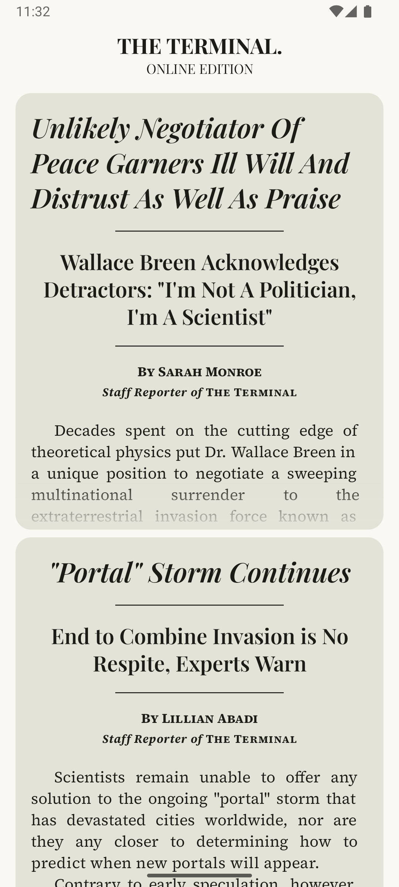
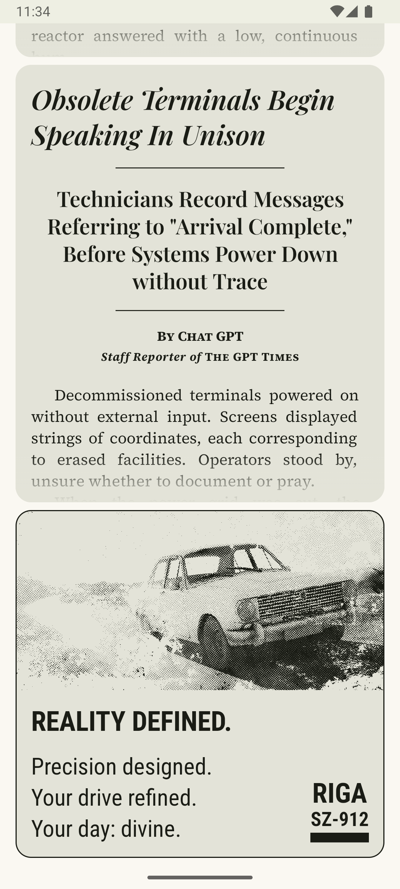

# The Terminal. App

The Terminal. is a simple Android app presenting a news feed in a newspaper-style layout, inspired 
by the Half-Life universe. Developed for educational purposes as part of the 
[Android Basics with Compose](https://developer.android.com/courses/android-basics-compose/course) 
course, the project started from a different template but evolved into this experimental app. 
It demonstrates core concepts such as creating and handling list, animations, state management, 
and Material 3 theming in Jetpack Compose.

## Content and References

Some content in this app is inspired by *Half-Life: Alyx*, specifically the in-game newspaper 
[The Terminal](https://half-life.fandom.com/wiki/The_Terminal). In particular:

- The app's name, “The Terminal.” comes directly from the in-game newspaper.
- Three news articles and their images were adapted; only the first two paragraphs of each article 
were used, not the full text.
- One advertisement card and its associated image were also adapted from the in-game material.

This project uses the following third-party library:

- [TextFlow](https://github.com/oleksandrbalan/textflow.git) 
by [oleksandrbalan](https://github.com/oleksandrbalan)

All content is used solely for educational and demonstrational purposes within this learning 
project.

## Screenshots

  
  
  

## Installation

This app supports Android 7.0 (API 24) and above.

1. Download the latest `.apk` from the [Releases](../../releases) page.
2. Enable *Install from unknown sources* on your device if required.
3. Open the APK to install.

> ⚠️ **Note:** If you prefer to verify the app’s integrity, you can build the project yourself 
> from source.

## Release Notes

See [Releases](../../releases)

## License
This project is licensed under the [MIT License](./LICENSE).

> ⚠️ **Note:** Some content in this app is derived from *Half-Life: Alyx*, which
> is Valve Corporation. This project is strictly non-commercial and used for
> educational/demonstrational purposes only.
>
> This project also uses the [Text Flow](https://github.com/oleksandrbalan/textflow.git) library,
> which is licensed under Apache 2.0.